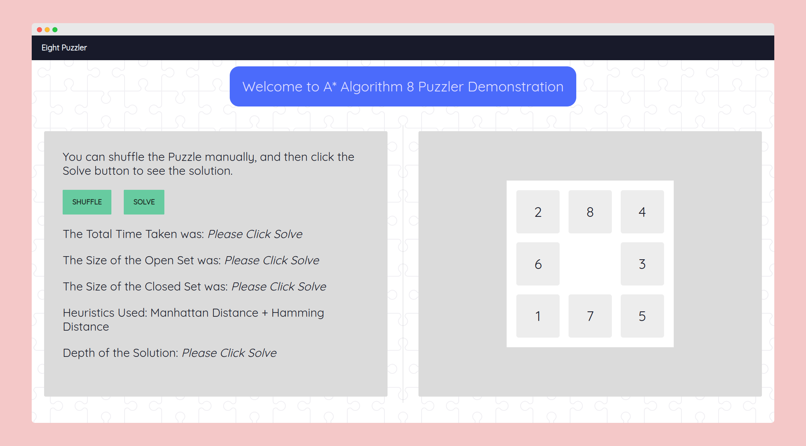

# Eight-Puzzler

An Implementation of the A\* algorithm to solve the classic 8 Puzzle. Made with Javascript.

# Demo

# Screenshots

# Credits

-   [A\* Algorithm](https://en.wikipedia.org/wiki/A*_search_algorithm)
-   [Gate Smashers](https://www.youtube.com/watch?v=nmWGhb9E4es&t=324s) for explaining the A\* algorithm and its implementation in the 8 Puzzle problem.
-   [8 Puzzle Solver by dgurkeynak](https://github.com/dgurkaynak/8-puzzle-solver) for insight into the graph of the 8 puzzle made by A\*.
